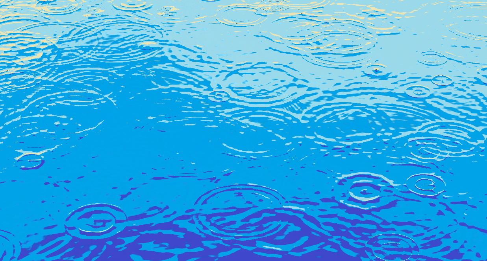

# ORRain

ORRain is an experimental simulation of rain drops on water surface for my art study. It presents water surface as pure reflection of background scene or sky depending on the curvature created by rain drops and their propagation. I copied the code by Evan Wallace (https://github.com/evanw/webgl-water) and modified it for my purpose.

This program is written and run in Processing 4 with p5.js mode using WebGL. To run the program, download the files into a folder and open it with Processing with p5.js mode. Then, execute. It will launch the simulation on your web browser.
 
The browser settings may need to be adjusted to use hardware acceleration, if available. For Chrome browser, go to chrome://settings/system and enable "Use graphics acceleration when available". Make sure that WebGL and WebGL2 are listed as "Hardware accelerated" in chrome://gpu.

The following are the mouse and key interactions implemented:

* mouse click: creates a rain drop at the mouse location.

* mouse drag: rotates or tilts the water surface.

* '+' or '-': zooms in or out.

* 'p': pauses the simulation.

There are several parameters in main.js to adjust the simulation such as frequency, strength, radius of rain drops. Replace 'land.png' and 'sky.png' by images with 256x256 pixels to have your own background and sky.

Pyungchul Kim, 2025

http://orderedrandom.com
